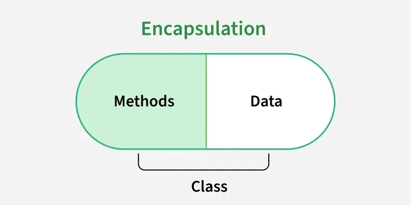

# Object Oriented Programming

Object - the properties and behaviour that describes an item
Class - blueprint to create the object

Who creates the object? - The JVM

## How to design the class

The class will basically have the properties (variables) and the behaviour (methods)


## Method overloading

```java
public int add(int num1, int num2) {
        System.out.println("In add function");
       int result = num1 + num2;
        return result;
    }

    public double add(double num1, int num2) {
        System.out.println("In add function");
        double result = num1 + num2;
        return result;
    }

    public double add(double num1, int num2, int num3) {
        System.out.println("In add function");
        double result = num1 + num2;
        return result;
    }

```

# Encapsulation

Encapsulation in Java is an object-oriented programming concept that bundles data and the methods that operate on that data into a single unit, such as a class. It also helps control access to the object's internal state by restricting direct access and providing controlled ways to read or modify it.

- Usually uses private fields to restrict direct access.
- Provides controlled access through methods such as getters and setters when required.
- Allows validation and other rules to be applied before changing data.



## How Encapsulation is Achieved in Java

Encapsulation is commonly implemented by:

- Declaring fields as private.
- Providing public or appropriately accessible methods to read or modify the fields.
- Adding validation inside methods when necessary.
- Keeping the internal implementation hidden from code outside the class.

## Rules:

- Declare data as private: Hide the class data so it cannot be accessed directly from outside the class.
- Use getters and setters: Keep variables private and provide public getter and setter methods for controlled access and safe modification, often with validation.
- Apply proper access modifiers: Use private for data hiding and public for methods that provide access.

# static keyword

## static variables
- It helps us set a constant value for a field.
- All objects will share the value
- The field should be accessed in a static way (using the Class)
- It makes the value belong to the class, not the object

## static functions
- You can call static variables within the function, but you cant call non-static variables

## Why do we use static in the main method?

- The main method is the entry point of a Java application. The JVM needs to be able to call it when starting the program.
- If main were an instance method (non-static), we would first need to create an object of its class to invoke it.
- But the JVM needs a defined entry point to start executing our application, so requiring an instance just to call main would introduce an unnecessary step.
- By declaring main as static, we make it a class-level method that the JVM can invoke without creating an object.

**Example:**
```java
class Demo {
    public static void main(String[] args) {
        System.out.println("Hello, World!");
    }
}
```

A static method can also be called directly using its class name:
```java
Demo.main(new String[]{});
```

>**Key takeaway:** static allows the JVM to invoke main without first creating an instance of the Demo class.


## Order of calling 

1. Class loads - Note that the class loads **only once**
2. Objects are instantiated

# Reference vs anonymous objects

## Reference objects

For example:
```java
Human n = new Human();
```

### Anonymous objects

Cannot be reused
Everytime you use this command, it creates a **new object**

```java
new Human();
```


# Inheritance

Java doesnt support multiple inheritance
e.g

```JAVA
class A {

}

class B {

}

class C extends A, B{

}
```

By default, when you call a constructor, it by default calls a function called:
```java
super();
```
Even though we dont see it.

**What does super() mean?**

>It means, call the default constructor of the super-class

**Every Class in Java extends the Object Class** 

Even if you dont mention it

```JAVA
class A extends Object{

}
```


# Method Overriding

Method overriding in Java allows a subclass to provide a specific implementation of a method that is already defined in its parent class. It is one of the key features of runtime polymorphism in object-oriented programming.

- Access modifier cannot be more restrictive than the parent method
- Achieved when child and parent classes have methods with the same signature
- Static, final, and private methods cannot be overridden

# Access Modifiers

*Private* - Access within same class
*Public* - Access from anywhere
*Default* - Access from within the same package
*Protected* - Access from same class, same package, different subpackage but not from different **non-subclass**


| Access from...                 | Private | Protected | Public | Default |
|--------------------------------|:-------:|:---------:|:------:|:-------:|
| Same class                     | ✅ | ✅ | ✅ | ✅ |
| Same package subclass          | ❌ | ✅ | ✅ | ✅ |
| Same package non-subclass      | ❌ | ✅ | ✅ | ✅ |
| Different package subclass     | ❌ | ✅ | ✅ | ❌ |
| Different package non-subclass | ❌ | ❌ | ✅ | ❌ |

This matches the standard Java access modifier rules. "Default" means package-private, i.e. no modifier written.


# Polymorphism

- Poly: many
- morphism: behaviour

-> The object will have different behaviours depending on how you call it

## Types of Polymorphism

- **Run-time Polymorphism / Late-Binding**: 

- **Compile-time Polymorphism / Early-Binding**: 


## final keyword

Can be used in: variables, methods, classes
It makes variables constant. like const in javascript

>Method overriding can be stopped my **making your method final**
>Class extending can be stopped my **making your class final**

# Abstract class

You cannot instantiate an object of an abstract class