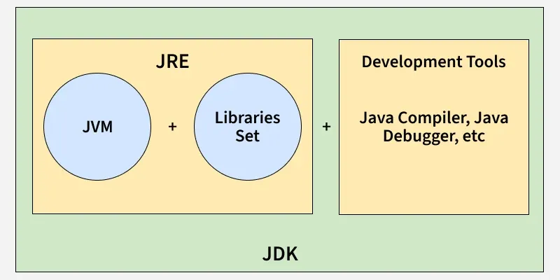
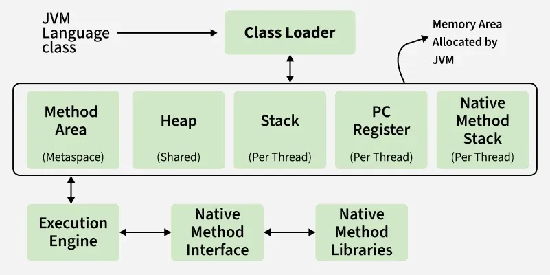

# JAVA FOUNDATION TO PRODUCTION.

## JDK, JVM, JRE

JDK (Java Development Kit), JRE (Java Runtime Environment), and JVM (Java Virtual Machine) represent different parts of Java development and execution.

The JDK provides the tools and runtime components needed to develop and run Java applications, while the JVM is responsible for executing Java bytecode.

>JDK: Java Development Kit

>JVM: Java Virtual Machine

>JRE: Java Runtime Environment

JDK provides development tools such as javac, java, jar, and javadoc, along with the components required to run Java applications.

JRE traditionally refers to the Java runtime environment consisting of the JVM and supporting runtime libraries. In modern Java, it should not always be understood as a separately installed package.

JVM loads and executes Java bytecode and provides services such as memory management and garbage collection.

## JDK (Java Development Kit)
The Java Development Kit (JDK) is a software development kit used to develop Java applications. It provides the Java compiler and other tools required to write, compile, test, package, document, and debug Java programs.

Includes compiler (javac), debugger, and utilities like jar and javadoc.
Includes the runtime components needed to execute Java applications in addition to development tools.

### Main Components of JDK
1. **Java compiler (javac)**: Compiles .java source files into .class bytecode files.
2. **Java launcher (java)**: Starts a Java application using the JVM.
3. **jar**: Creates and manages JAR files.
4. **javadoc**: Generates documentation from Java source code.
5. **Debugging and other development tools**: Help developers test and troubleshoot applications.
6. **JVM and runtime libraries**: Required to run Java applications.

### Working of JDK
The basic development process is:

1. **Write source code**: The developer creates a .java file.
2. **Compile**: javac compiles the source code.
3. **Generate bytecode**: The compiler produces .class files containing Java bytecode.
4. **Run**: The java launcher starts the JVM, which loads and executes the bytecode.

## JRE (Java Runtime Environment)
The Java Runtime Environment (JRE) traditionally refers to the components required to run a Java application. It consists primarily of the JVM and the Java runtime libraries.

### Main Components of JRE
1. **JVM**: Executes Java bytecode.
2. **Java class libraries**: Provide commonly used Java APIs required by applications.
3. **Supporting runtime files**: Help the JVM and libraries operate.

### Working of JRE
When a Java application is started:

1. The JVM is launched.
2. The Class Loader loads the required .class files.
3. The JVM performs linking and initialization.
4. The bytecode is interpreted and/or compiled into native machine code by the JVM.
5. The application executes using the Java runtime libraries.

*Important: For current Java versions, avoid describing JRE as a separately installed package for every modern JDK distribution. The concept remains useful for understanding Java's runtime environment, but modern JDK installations are generally used directly.*

## JVM (Java Virtual Machine)
The Java Virtual Machine (JVM) is the runtime engine that executes Java bytecode. When Java source code is compiled, the compiler generates bytecode in .class files. The JVM loads this bytecode and executes it on the underlying operating system and hardware.

### Main Responsibilities of JVM
1. Loads Java classes using the Class Loader.
2. Verifies and links loaded classes.
3. Executes Java bytecode.
4. Uses the JIT compiler to compile frequently executed bytecode into native machine code.
5. Manages runtime memory.
6. Performs garbage collection.
7. Provides runtime security and other execution services.

### Working of JVM
The major stages are:

1. **Loading**: The Class Loader loads required classes into JVM memory.

2. **Linking**: Linking consists of:

- **Verification**: Checks that the bytecode is structurally and semantically valid.
- **Preparation**: Allocates memory for static fields and assigns default values.
- **Resolution**: Resolves symbolic references when required.

3. **Initialization**: The JVM initializes classes and executes their static initialization code.

4. **Execution**: The JVM executes the bytecode. It may interpret bytecode and use the JIT compiler to compile frequently executed code into native machine code for better performance.

### JDK vs JRE vs JVM

| Aspect | JDK | JRE | JVM |
| :--- | :--- | :--- | :--- |
| **Full Form** | Java Development Kit | Java Runtime Environment | Java Virtual Machine |
| **Purpose** | Develop and run Java applications | Provide the runtime environment | Execute Java bytecode |
| **Main Users** | Developers | Application users/runtime environments | Runtime engine |
| **Contains** | Development tools + runtime components | JVM + runtime libraries | Execution engine and runtime subsystems |
| **Compiler** | Includes javac | Does not provide the compiler | Does not compile .java source code |
| **Runs Java programs** | Yes | Yes, conceptually | Yes |
| **Platform** | JDK builds are platform-specific | Runtime implementation is platform-specific | JVM implementation is platform-specific |
| **Bytecode** | Produces bytecode using javac | Provides environment to run bytecode | Executes bytecode |
| **Memory Management** | Through its JVM/runtime | Through its JVM | Directly manages runtime memory |
| **Garbage Collection** | Through its JVM | Through its JVM | Performs garbage collection |