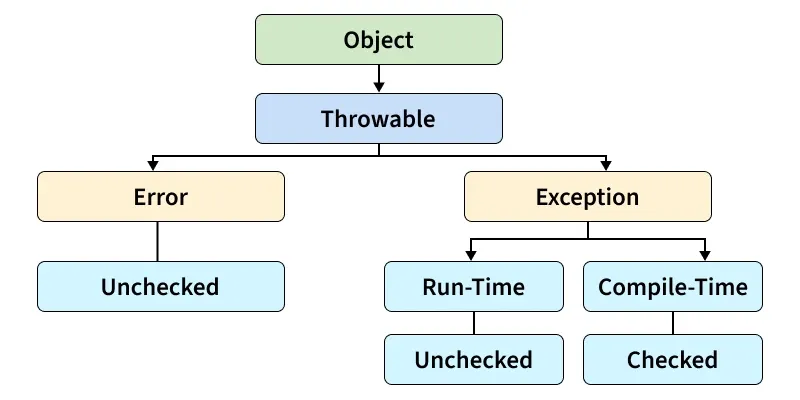
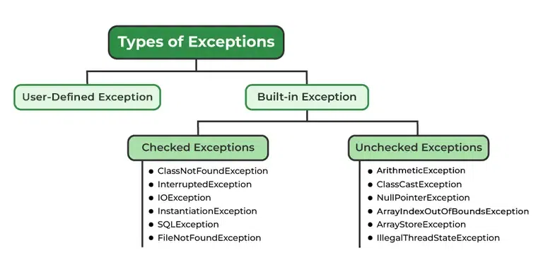

# Exceptions

## Types of Exceptions
## Errors

1. Compile-time
2. Run-time
3. Logical

| Feature | Compile-Time Error | Runtime Error | Logic Error |
|---|---|---|---|
| **When does it happen?** | During code compilation (before the program ever runs). | During program execution (while the program is running). | During program execution, but only noticed during testing or use. |
| **Does the program run?** | **No.** The compiler refuses to build an executable file. | **Yes, but it crashes** halfway through when it hits the bad line. | **Yes.** It runs from start to finish without crashing. |
| **Does it give an error message?** | **Yes.** The compiler or IDE explicitly tells you what and where the issue is. | **Yes.** The operating system or interpreter throws an exception (e.g., crash/crash log). | **No.** The computer thinks everything is fine and gives no message. |
| **What causes it?** | Violating the strict syntax or type rules of the programming language. | Asking the computer to perform an impossible or illegal operation. | Flaws in the programmer's math, thinking, or algorithm design. |
| **Common Examples** | Missing a semicolon or bracket Typoed keywords (e.g., `prnt` instead of `print`) Type mismatches (e.g., assigning a string to an integer variable) | Dividing by zero (`x / 0`) Array index out of bounds Trying to open a file that doesn't exist Running out of memory | Using the wrong formula (e.g., `average = a + b / 2` instead of `(a + b) / 2`) Using a `>` instead of `<` in an `if` statement An infinite loop that never terminates |
| **How do you fix it?** | Read the compiler error and fix the syntax or type error. | Add defensive code validation (like checking if a file exists first) or use `try-catch` blocks. | Trace your code line-by-line, use debugging tools, or write **unit tests** to verify outputs. |

# Statements

1. Normal
2. Critical

## Throwable

>SideNote:
>- Anything that has the suffix *"able"* are **Interfaces** 
>except for Throwable which is a Class.

Errors and Exceptions extend the Throwable class

Errors such as ThreadDeath, IOError, VirtualMachine Error, OutOfMemory cant be handled by us.

Exceptions are what we can handle

