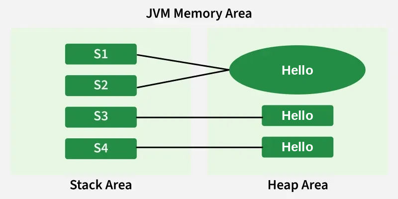

# Strings

A String in Java is an object used to store a sequence of characters enclosed in double quotes.
It uses UTF-16 encoding and provides methods for handling text data.

Each character in a string is stored using 16-bit Unicode (UTF-16) encoding.
**Strings are immutable**, meaning their value cannot be changed after creation.
Java provides a rich API for manipulation, comparison, and concatenation of strings.

## Examples

```java
String name = "Names";
String num = "1234";
String str = new String("Names2");
```

# Ways Of Creating a Java String
There are two ways to create a string in Java: 

## 1. String literal (Static Memory)
To make Java more memory efficient (because no new objects are created if it exists already in the string constant pool). Java stores string literals in the String Pool. If the same literal already exists in the pool, Java can **reuse** the existing String object.

**Example:**

```java
String str = “GeeksforGeeks”; 
```

## 2. Using new keyword (Heap Memory)
Using the new keyword creates a new object in heap memory, even if the same string already exists in the pool.

One object is created in the heap memory
The string literal is stored in the string pool (if not already present)
The reference variable points to the heap object, not the pool

**Example:**

```java
String str = new String (“GeeksforGeeks”);
```

# Immutable String in Java
In Java, string objects are immutable. Immutable simply means unmodifiable or unchangeable. Once a string object is created its data or state can't be changed but a new string object is created.


```java
​
        String str = "Hello";
​
        str.concat(" World");
​
        System.out.println(str); //Hello

```

## Explanation:
In the above example, the String.concat() does not modify the original String object. When str.concat(" World") is executed:

A new String object "Hello World" is created.

>The original String "Hello" remains unchanged.

Since the new object is not assigned to any variable, it is *discarded*.    

## String constant pool

The String Constant Pool (SCP), also known as the String Intern Pool, is a specialized memory region inside the Java Heap that stores string literals. 

Because String objects are immutable and highly prevalent in programming, the Java Virtual Machine (JVM) uses this pool as an *optimization technique* to _save memory_ and improve execution speed

### How the Pool Handles Memory
When you declare a string, the memory allocation depends entirely on how you write the code.

```java
//Scenario 1: Using a String Literal
String s1 = "Hello"; 
String s2 = "Hello"; 

// Scenario 2: Using the 'new' Keyword
String s3 = new String("Hello");
String s4 = new String("Hello");
```

**1. String Literal Declaration (s1 and s2)**

When you declare a string using double quotes, the JVM performs an internal check:

It checks the String Constant Pool to see if a string with the exact value "Hello" already exists.

If it does not exist, a **new string object** is created inside the pool.

If it does exist, the JVM simply returns a **reference** to that existing object **instead of creating a new one.**

As a result, both s1 and s2 point to the exact same memory location. If you evaluate s1 == s2 (which checks reference equality), it returns true

**2. Using the new Keyword (s3)**

When you use the new operator, you explicitly instruct the JVM to bypass standard pooling behavior:

The JVM overrides the pool reuse and allocates a completely separate, unique object in the regular heap memory, outside of the String Constant Pool.

Because s3 points to a distinct heap instance while s1 points to a pool instance, evaluating s1 == s3 returns false

### JVM Memory Area
s1 and s2 use the same String literal, so they can refer to the same String Pool object. 

s3 and s4 are created using new, so each represents a separate String object on the heap. 

All four variables contain the same text, "Hello".




| Operation Type | Syntax Example | Object Creation Behavior | Memory Location | Reference Check (`==`) |
|---|---|---|---|---|
| Literal | `String s1 = "Java";` | Reuses existing reference if present; creates new pool object if absent. | String Constant Pool (Heap) | `s1 == s2` is true if values match |
| Constructor | `String s3 = new String("Java");` | Always generates a brand-new object instance. | General Heap Area | `s1 == s3` is always false |

# Storage

Note: All objects in Java are stored in a heap. The reference variable is to the object stored in the stack area or they can be contained in other objects which puts them in the heap area also.

# Mutable Strings
**StringBuffer**: A mutable and thread-safe class used for string manipulation in multithreaded environments.

**StringBuilder**: A mutable and non-thread-safe class that provides faster string manipulation in single-threaded applications.