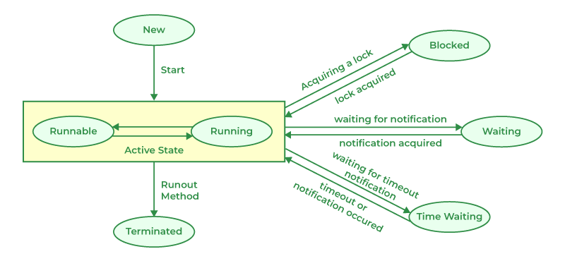

# THREADS

A thread in Java is the smallest unit of execution within a process. 
Threads allow multiple tasks to execute concurrently while sharing the resources of the same process. 

Threads are commonly used for tasks such as background processing, file operations, network requests, and handling multiple client requests.

## How Threads and Cores Work Together

Threads share the memory and resources of their process.

The number of threads running at a time corresponds with the number of cores.

The scheduler handles how they are processed

• **Parallel Execution:** True physical parallelism happens when the number of running threads matches or is less than the number of available CPU cores.

• **Concurrency and Time Slicing:** When an application runs more threads than available cores, the scheduler assigns threads to cores for brief time periods, rapidly switching between them to create the illusion of simultaneous execution.

• **Resource Sharing:** Threads inside a process share the same memory space, global variables, and open files, while keeping individual stacks and registers private for independent execution.

## run

For every thread, we need a run() method

**Example:**

```java
class A extends Thread {
    public void run() {
        for (int i = 0; i < 5; i++) {
            System.out.println("hi A");
        }

    }
}

class B extends Thread {
    public void run() {
        for (int i = 0; i < 5; i++) {
            System.out.println("hi B");
        }

    }
}

```

To run the thread, we need to call the start() method

```java
A obj1 = new A();
B obj1 = new B();
obj1.start();
obj2.start();
 ```

## Thread Priority

**How do we give the scheduler a preference for which threads should get CPU time?**

Java allows us to assign a **priority** to each thread.

Thread priorities range from **1 to 10**:

* **1** → Lowest priority
* **5** → Default priority
* **10** → Highest priority

```java
obj2.getPriority();  // Returns the thread's priority (5 by default)
```

### `setPriority()`

We can change a thread's priority using `setPriority()`:

```java
obj2.setPriority(10); // Sets the thread to the highest priority
```

However, **thread priority is only a scheduling hint, not a guarantee**.

It tells the JVM/underlying operating system that a thread should be given preference, but the scheduler ultimately decides when each thread gets CPU time.

Therefore:

> **A higher-priority thread is not guaranteed to execute before a lower-priority thread.**

For example, setting one thread to priority `10` and another to priority `1` does **not** mean the priority-10 thread must finish first or even start first.

The actual scheduling behavior depends on the **JVM and underlying operating system**.

### Key takeaway

**Thread priority influences scheduling; it does not determine scheduling.**


# Runnable

### The problem with extending `Thread`

What if we want our class to **run as a thread**, but we also need it to extend another class?

In Java, a class can extend **only one class**.

For example:

```java
class C extends SomeOtherClass {
    // ...
}
```

We cannot also do:

```java
class C extends SomeOtherClass, Thread {  // ❌ Not allowed
    // ...
}
```

So, how can we create a thread without extending the `Thread` class?

### The solution: `Runnable`

Java provides the **`Runnable` interface** for this purpose.

`Runnable` defines a single important method:

```java
public void run();
```

We implement `Runnable` and provide our own implementation of `run()`.

```java
class C implements Runnable {

    public void run() {
        // code to be executed by the thread
    }
}

class D implements Runnable {

    public void run() {
        // code to be executed by the thread
    }
}
```

But there is one important point:

> **Implementing `Runnable` does not create a thread.**

`C` and `D` are simply classes that define work that can be executed by a thread.

We then pass the `Runnable` objects to a `Thread`:

```java
public class DemoRunnable {

    public static void main(String[] args) {

        // C and D are Runnable objects
        Runnable objC = new C();
        Runnable objD = new D();

        // Pass the Runnable objects to Thread
        Thread t1 = new Thread(objC);
        Thread t2 = new Thread(objD);

        // Start the threads
        t1.start();
        t2.start();
    }
}
```

### What's happening here?

There are **two separate responsibilities**:

**`Runnable` → defines the work**

```java
public void run() {
    // work to be performed
}
```

**`Thread` → provides the thread that executes the work**

```java
Thread t1 = new Thread(objC);
t1.start();
```

When we call:

```java
t1.start();
```

the new thread is created, and the JVM eventually invokes:

```java
objC.run();
```

### Why is this useful?

The biggest advantage is that our class is **not forced to extend `Thread`**.

Since Java allows a class to extend only one class, we can instead extend another class and implement `Runnable`:

```java
class C extends SomeOtherClass implements Runnable {

    public void run() {
        // thread work
    }
}
```

This gives us both:

* inheritance from `SomeOtherClass`
* the ability to define work that can be executed by a `Thread`

### Key takeaway

> **`Thread` represents the thread, while `Runnable` represents the work that the thread should execute.**

This separation is one of the main reasons `Runnable` is preferred over directly extending `Thread` when designing concurrent code.


# Race Conditions

A race condition occurs when two or more processes or threads access and modify the same data at the same time, and the final result depends on the order in which they run. Without proper coordination, this can lead to incorrect or unpredictable results.

For example: If two people update the same bank account simultaneously without checking each other’s changes, the final balance may be wrong.

- **Shared Resource:** A variable, file, memory location, or device accessed by multiple processes.
- **Concurrency**: Multiple processes or threads executing simultaneously or overlapping in execution.
- **Non-Atomic Operations**: Operations that can be interrupted, such as read-modify-write, which can cause inconsistent states when multiple processes access the same data concurrently.


## Causes of Race Conditions
1. **Simultaneous Access:** When two or more processes try to read or write the same shared resource at the same time.
2. **Non-Atomic Updates:** Operations like increment or decrement are not indivisible.
3. **Lack of Synchronization:** No mechanisms like locks, semaphores, or monitors are used to control access.
4. **Improper Scheduling:** OS scheduler interrupts processes at critical moments.


## Prevention Techniques (making it thread-safe)

1. **Mutex (Mutual Exclusion):** Ensure only one process can enter the critical section at a time.
2. **Semaphores**: Counting or binary semaphores control access to resources.
3. **Monitors**: High-level synchronization constructs that manage shared resources.
4. **Atomic Operations:** Use hardware or software-supported atomic instructions.
5. **Disable Interrupts (for kernel-level programming):** Prevent context switches during critical sections.
6. **Proper Scheduling:** Ensure the scheduler does not preempt critical section execution.


### `join()`

The `join()` method allows one thread to wait for the completion of another thread. 
When a thread calls `join()` on another thread, it pauses its execution until the other thread has finished executing.


### `synchronized` keyword

The `synchronized` keyword in Java is used to control access to a block of code or method by multiple threads. It ensures that only one thread can execute the synchronized code at a time, preventing race conditions and ensuring thread safety.

When a thread enters a synchronized block or method, it acquires a lock on the object being synchronized. Other threads attempting to enter the synchronized block or method will be blocked until the lock is released.

# States of Threads

1. New state
2. Runnable state
3. Running state
4. Waiting state
5. Timed Waiting state
6. Blocked state
7. Dead / Terminated State

